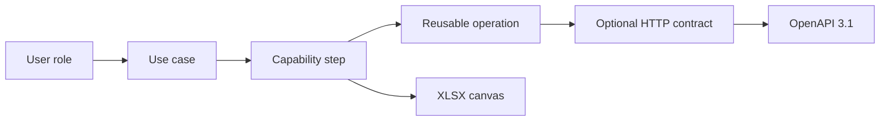

# API Capabilities Canvas

An offline-first React application for designing an API from the people and business outcomes it serves. A canvas starts with users, use cases, and steps; reusable operations and HTTP contracts are derived afterward.

The repository is intentionally structured as learning material. Domain decisions are kept outside React, browser storage has a small repository boundary, imported data is validated at runtime, and generated OpenAPI is checked by tests against a real parser.

## What Problem It Solves

API design often starts too early with endpoints. This application keeps two concerns separate:

1. **Capability discovery** asks who uses the API, what they need to achieve, and what success or failure means.
2. **Transport design** maps reusable operations to HTTP methods, paths, parameters, payloads, responses, and JSON Schema components.



A single operation can support steps in several use cases. The seeded Commerce API demonstrates this by reusing "Search for products" for a shopper and a catalog administrator.

## Features

- Multiple API canvases stored locally in IndexedDB through Dexie.
- Inline editing for users, use cases, capability steps, and reusable operations.
- Bounded undo and redo history for workspace edits.
- Debounced automatic persistence with visible save state.
- Live validation with error, warning, and informational severity.
- HTTP contract editing for methods, paths, parameters, request bodies, responses, and media types.
- Reusable JSON Schema components with structured and raw JSON editing modes.
- Reference-aware schema rename, cascade deletion, and role/operation merge operations.
- Versioned JSON import/export for one API or a complete workspace bundle.
- OpenAPI 3.1 export as JSON or YAML.
- XLSX export with capability, operation, and API information worksheets.
- Static hosting support through `HashRouter` and a relative Vite base path.
- Responsive, keyboard-accessible editing controls with mobile touch targets.

## Quick Start

### Prerequisites

- Node.js 22 or newer.
- Corepack, included with supported Node.js distributions.
- A current Chromium, Firefox, or Safari browser with IndexedDB and ES2023 support.

### Install And Run

```powershell
corepack pnpm install --frozen-lockfile
corepack pnpm dev
```

Open `http://127.0.0.1:5173/`. The first database creation seeds a Commerce API example.

The workspace also contains a VS Code launch configuration named **Run API Capabilities Canvas**. It starts the Vite task and launches Microsoft Edge with source maps.

### First Walkthrough

1. Open **Commerce API** from the library.
2. Use **Canvas** to edit a user, use case, step, or operation inline.
3. Open **Operations** to see steps regrouped around reusable operations.
4. Open **Contracts** and create a contract for an operation that does not have one.
5. Resolve any errors shown in **Validation and persistence**.
6. Export OpenAPI JSON or YAML from the workspace header.
7. Return to the library to export a JSON workspace bundle or an XLSX canvas.

Browser data remains on the current origin. Clearing site data or using a different origin creates a different local workspace.

## Commands

Run package commands through Corepack so the pinned pnpm version is used consistently.

| Command | Purpose |
| --- | --- |
| `corepack pnpm dev` | Start the Vite development server with hot module replacement. |
| `corepack pnpm typecheck` | Check both TypeScript project references without emitting files. |
| `corepack pnpm lint` | Run oxlint with TypeScript and React rules. |
| `corepack pnpm test:unit` | Run all Vitest suites once. |
| `corepack pnpm test:watch` | Run Vitest in watch mode while developing. |
| `corepack pnpm build` | Typecheck and create the production bundle in `dist/`. |
| `corepack pnpm preview` | Serve the production bundle locally. |
| `corepack pnpm check` | Run the complete gate: typecheck, lint, tests, and production build. |

Use `corepack pnpm check` before requesting review. Pull requests and GitHub Pages deployment run the same script.

## Repository Map

```text
src/
    db/                    IndexedDB schema and repository operations
    domain/                Types, pure mutations, selectors, and validation
    features/
        export/              OpenAPI, YAML, XLSX, and browser downloads
        interchange/         Versioned JSON envelopes and Zod decoders
        library/             Multi-API library page
        workspace/           Canvas, operation, contract, and schema editors
    test/                  Shared Vitest browser setup
```

The dependency direction is deliberate: feature code may call domain and database modules, but domain code does not import React, Dexie, or export libraries.

## Documentation

- [Architecture](docs/ARCHITECTURE.md): boundaries, data flow, design decisions, and extension points.
- [Domain model](docs/DOMAIN_MODEL.md): entities, references, mutation semantics, and validation rules.
- [Data and exports](docs/DATA_AND_EXPORTS.md): IndexedDB, JSON interchange, schema handling, OpenAPI, and XLSX behavior.
- [Development guide](docs/DEVELOPMENT.md): setup, common changes, debugging, and code conventions.
- [Testing guide](docs/TESTING.md): test strategy, suite inventory, and test patterns.
- [API reference](docs/API_REFERENCE.md): exported module contracts and important edge behavior.
- [Contributing](CONTRIBUTING.md): branch, review, accessibility, and quality expectations.

## Quality And Deployment

The repository uses strict TypeScript project references, oxlint, Vitest, Swagger Parser, fake IndexedDB, and production builds as complementary checks. Tests are colocated with their owning modules.

Two GitHub Actions workflows are provided:

- `.github/workflows/quality.yml` runs the complete gate for pull requests.
- `.github/workflows/deploy-pages.yml` runs the same gate on `main`, then deploys `dist/` to GitHub Pages.

ExcelJS and YAML are loaded only when their exports are requested. Vite places storage, routing, icons, YAML, and spreadsheet code in separate chunks.

## Current Boundaries

- There is no backend, account, synchronization, or collaborative editing.
- IndexedDB data belongs to one browser profile and origin; JSON export is the backup and transfer mechanism.
- Database schema version 1 and interchange schema version 1 have no historical migration yet. The documented versioning process must be followed before either changes.
- The structured schema editor intentionally supports only lossless flat object schemas. Advanced JSON Schema remains editable in JSON mode.
- Dedicated `schemaRef` fields support local `#/components/schemas/...` references. Advanced or external references may still be represented inside raw JSON Schema, but the application does not fetch remote schemas.
- OpenAPI generation covers the HTTP methods represented by the domain model: GET, POST, PUT, PATCH, and DELETE.
- Destructive library and merge actions use browser confirmation dialogs. Domain mutations and validation remain independently testable if a custom dialog is introduced later.

These are explicit product boundaries, not hidden TODOs. See the architecture and data guides before changing them.
