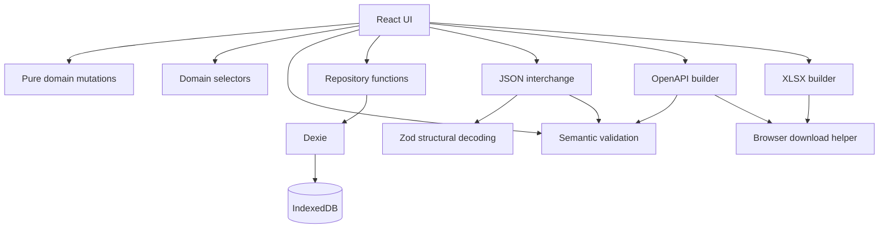
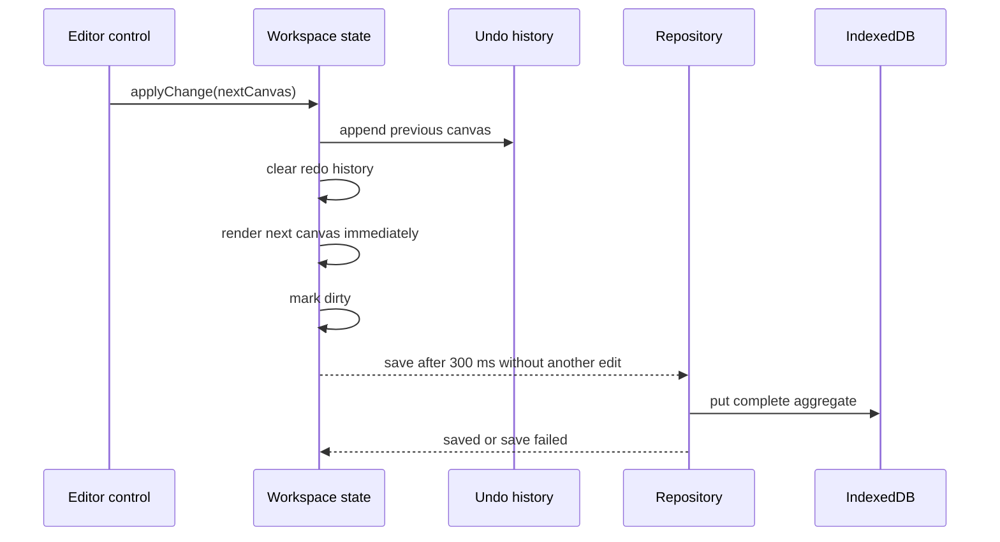

# Architecture

This document explains why the application is structured as it is, how data moves through it, and which boundaries contributors should preserve. It describes the current implementation rather than an idealized future system.

## Design Goals

1. Model business capabilities before transport details.
2. Keep one API canvas internally consistent as a single aggregate.
3. Work fully offline without a backend or login.
4. Make domain behavior deterministic and easy to unit test.
5. Reject malformed imported data at a runtime trust boundary.
6. Generate interoperable OpenAPI and spreadsheet artifacts.
7. Remain deployable as static files on GitHub Pages.

## Non-Goals

- Multi-user collaboration or server synchronization.
- Importing an arbitrary OpenAPI document into a canvas.
- A complete visual editor for every JSON Schema 2020-12 keyword.
- Remote `$ref` retrieval or schema registry integration.
- Enforcing domain references through separate database tables.

## System View



### Dependency Rule

The domain layer owns meaning and must remain framework-independent.

```text
UI/features -> domain
UI/features -> repository
repository  -> domain + Dexie
domain      -> no UI, storage, or export dependency
```

This direction lets tests execute business behavior without rendering React or opening IndexedDB. Do not move validation, cascade rules, or reference rewriting into event handlers.

## Layer Responsibilities

### Domain

Files in `src/domain/` define the `ApiCanvas` aggregate and operations over it.

- `apiCanvas.ts` contains types, the empty-canvas factory, and teaching sample data.
- `mutations.ts` contains pure immutable transformations.
- `selectors.ts` joins normalized references into display/export rows.
- `validation.ts` reports semantic issues without throwing.

Domain arrays are `readonly` at their public boundary. A mutation returns a new canvas and updates `updatedAt`; callers replace their previous value. This makes history snapshots safe to keep by reference and prevents React event code from mutating shared state accidentally.

### Persistence

`src/db/database.ts` defines one Dexie database and its schema. `src/db/apiCanvasRepository.ts` exposes task-oriented operations rather than leaking Dexie queries into components.

Each complete canvas is stored as one IndexedDB record. This is intentionally different from the normalized in-memory references:

- A canvas is the consistency and import/export boundary.
- Loading and saving one aggregate is simple and atomic.
- The expected data volume is small enough that record-level replacement is appropriate.
- Cross-canvas queries are limited to library metadata and do not justify many tables.

The `preferences` table is reserved for settings but is not currently used.

### Runtime Interchange Boundary

TypeScript types disappear at runtime. JSON import therefore has two checks:

1. Zod verifies envelope shape and recursively validates known JSON Schema keyword types.
2. `validateApiCanvas` verifies references, uniqueness, required narratives, HTTP syntax, and schema source rules.

Unknown JSON Schema keywords are preserved for forward compatibility. Known keywords with the wrong type are rejected rather than cast into the domain model.

### Features And UI

Feature modules orchestrate domain, storage, and browser behavior.

- The library observes IndexedDB through `useLiveQuery`.
- The workspace owns the active canvas, history, selection, save state, and recoverable action errors.
- `CanvasModelTabs.tsx` focuses on capability editing and operation regrouping.
- `ApiWorkspacePage.tsx` owns contracts, schemas, workspace routing, and persistence orchestration.
- Export modules map domain values to external formats; they do not read component state.

The larger workspace module is a composition root for a feature with many closely coupled controls. New independent editors should be extracted when they gain their own state or tests; avoid abstraction based only on line count.

## Aggregate And Reference Design

`ApiCanvas` contains normalized collections. Child records refer to parents by stable string IDs:

- `UseCase.roleId -> UserRole.id`
- `Step.useCaseId -> UseCase.id`
- `Step.operationId -> Operation.id`
- HTTP schema refs use `#/components/schemas/{SchemaComponent.name}`

Normalized collections make operations reusable across use cases and avoid deeply nested update code. The tradeoff is that referential integrity must be maintained explicitly. The project does that through guarded factories, cascade/merge mutations, schema rename rewriting, import validation, and live issue reporting.

## State, History, And Saving

The workspace follows this sequence for a normal edit:



Important details:

- History keeps at most 40 prior canvases. `applyChange` appends the current canvas and clears future history.
- Undo moves the current canvas to `future`; redo moves it back to `past`.
- Undo and redo are persisted just like any other edit.
- Save effects cancel their pending timer when a newer canvas arrives. An already-started save cannot update visible state after cancellation.
- A failed save leaves the canvas dirty and reports `save failed`; a later edit triggers another attempt.
- Workspace loading has a fatal error boundary. Export failures are recoverable banners and do not replace the editor.
- Changing `apiId` clears the previous canvas before loading the next one, preventing stale content from flashing under a new route.

History is in memory only. Reloading starts a new history while retaining the latest persisted canvas.

## Validation Philosophy

Validation returns structured issues instead of throwing so the editor can remain usable while a canvas is incomplete.

| Severity | Meaning | Typical behavior |
| --- | --- | --- |
| `error` | A violated invariant or invalid output field. | Blocks JSON import. Relevant errors block OpenAPI export. |
| `warning` | Valid but incomplete or suspicious design. | Shown to the user; export may continue. |
| `info` | An expected work-in-progress state. | Used for operations that do not yet have HTTP contracts. |

OpenAPI export intentionally ignores errors that belong only to capability narratives because those fields are not represented in OpenAPI. It blocks errors for API title/version, operations, and schemas. JSON import blocks every error because imported canvases must be internally coherent.

See [DOMAIN_MODEL.md](DOMAIN_MODEL.md) for the complete rule catalog.

## Schema Editing Strategy

JSON Schema has a large vocabulary. The structured editor therefore advertises support only when it can round-trip a schema without losing information:

- Root keywords: `type`, `properties`, and `required`.
- Property keywords: `type` and optional `description`.
- Flat property definitions only.

Schemas containing metadata, enum, format, nested properties, array items, or any other keyword open in JSON mode. This conservative decision is preferable to a friendly editor that silently destroys data.

Structured property row IDs are deterministic while editing, so React does not remount inputs on every keystroke. A new property receives a non-empty unique default name so it survives conversion to an object map.

## Export Architecture

### OpenAPI

The OpenAPI builder validates before mapping. It merges different methods for the same path, sorts responses and component schemas for deterministic output, and preserves boolean JSON Schemas and empty examples.

Schema-bearing values have one source: either `schemaRef` or inline `schema`. Validation rejects both together. The mapper still has an explicit reference-first branch as defensive code.

### XLSX

ExcelJS is dynamically imported because it is much larger than the editor runtime. The workbook builder emits three worksheets and returns an `ArrayBuffer`; the browser download helper owns Blob and object URL lifecycle.

### Browser Downloads

One helper creates a hidden anchor, attaches it to the document, triggers the click, removes the element, and revokes its object URL on the next task. Delayed revocation lets the browser consume the Blob before its URL is released.

## Static Hosting And Routing

GitHub Pages cannot rewrite arbitrary paths to `index.html`. The application uses:

- `HashRouter`, so the route lives after `#` and never reaches the static server.
- Vite `base: './'`, so generated asset paths are relative to the deployed directory.

Unknown application routes redirect to the library. Unknown workspace tabs redirect to that API's canvas route.

## Bundle Boundaries

`vite.config.ts` defines chunks for ExcelJS, YAML, Dexie, React Router, Lucide icons, and remaining vendor code. The intent is behavioral:

- Opening and editing a canvas must not download spreadsheet generation code.
- YAML parsing/generation is loaded only for YAML export.
- Storage and routing remain cacheable independently of feature changes.

Chunk names are not public API. Reassess manual chunks after major dependency upgrades by inspecting production build sizes.

## Error Handling

| Boundary | Strategy |
| --- | --- |
| Domain validation | Return issues; do not throw. |
| Invalid JSON/Zod decode | Throw to the import handler; show the message. |
| Invalid imported canvas | Throw combined blocking issue messages before persistence. |
| IndexedDB load failure | Show a fatal workspace message with a route back to the library. |
| Save failure | Preserve local state and show `save failed`. |
| Export failure | Show a dismissible recoverable banner. |
| Browser download setup | Always remove the temporary anchor and schedule URL cleanup. |

Catch blocks at I/O boundaries convert technical failure into user-facing context. Pure domain functions do not catch programmer errors silently.

## Design Decisions And Tradeoffs

### Why One Canvas Record?

It matches the aggregate, makes import/export direct, and keeps transactions small in number. It is less suitable for extremely large canvases or cross-canvas reporting; those are outside the current scope.

### Why Pure Mutations Instead Of A State Library?

The state graph is one aggregate plus small UI state. Pure functions provide predictable updates, straightforward tests, and simple history without introducing action/reducer infrastructure. A state library would be justified if collaboration, server cache state, or many independently loaded aggregates are added.

### Why Zod And Semantic Validation?

Structural and semantic rules evolve for different reasons. Zod protects the runtime type boundary; domain validation produces product-specific, path-addressable feedback. Combining them would make editor feedback and version migrations harder to reason about.

### Why Keep Missing Contracts As Info?

The product supports business-first design. Requiring an HTTP contract when an operation is created would collapse capability discovery and transport design into one step.

### Why Use Browser Confirmation Today?

Confirmation is a small dependency-free safeguard for destructive library and merge operations. It is not a domain dependency. A custom dialog can replace it when richer impact previews or focus trapping are required.

## Extension Guide

### Add A Domain Field

1. Add it to the domain interface and factory/sample defaults.
2. Add it to the recursive Zod envelope schema.
3. Decide whether it requires semantic validation.
4. Update duplication, import/export, and persistence assumptions.
5. Expose it in the owning UI.
6. Add round-trip and behavior tests.
7. Decide whether interchange `schemaVersion` must change.

### Add A Mutation

1. Put reference and cascade behavior in `mutations.ts`.
2. Return the original canvas for an invalid no-op request when that is part of the API contract.
3. Otherwise return a new touched canvas.
4. Test output references and preservation of unrelated entities.
5. Invoke it from UI code through `applyChange` so history and persistence remain consistent.

### Add An Export Format

1. Create a module under `src/features/export/`.
2. Define which validation errors block that format.
3. Keep the builder independent from the DOM.
4. Return text, `BlobPart`, or a typed document.
5. Test deterministic structure with a real consumer/parser when one exists.
6. Trigger download through `download.ts`.
7. Add a manual Vite chunk if the exporter is large and rarely used.

### Change Persistent Or Interchange Shape

Do not edit a versioned shape in place. Follow the migration process in [DATA_AND_EXPORTS.md](DATA_AND_EXPORTS.md), add fixtures for old data, and document compatibility before changing version numbers.
