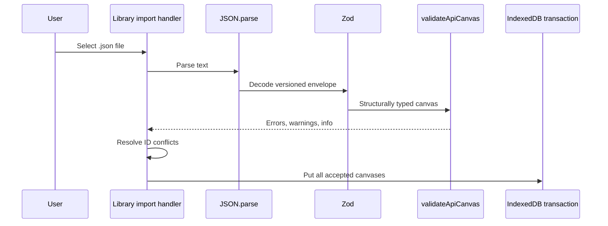

# Data, Interchange, And Exports

This guide describes where data lives, how it crosses trust boundaries, what each export contains, and how to evolve versioned formats without losing browser data.

## Local Persistence

### Database

The application opens a Dexie database named `api-capabilities-canvas`.

Database version 1 contains:

| Table | Primary key and indexes | Purpose |
| --- | --- | --- |
| `apiCanvases` | `id`, indexes on `name` and `updatedAt` | Stores each complete `ApiCanvas` aggregate. |
| `preferences` | `id` | Reserved generic string preferences; currently unused. |

`listApiCanvases` orders the `updatedAt` index in reverse, so the most recently mutated canvas appears first.

### Initial Sample Lifecycle

Dexie's `populate` event inserts `sampleCanvas` only when a new database is first created. This has two consequences:

1. A first-time user receives a useful example.
2. Deleting every API leaves an intentionally empty library; reopening the existing database does not silently reseed it.

The **Add example API** command calls `seedSampleApiCanvas`, which runs a read/write transaction and inserts the sample only when `demo-canvas` is absent. Its boolean result distinguishes insertion from an already-present sample.

### Repository Operations

Components use repository functions instead of Dexie directly:

- List, get, create, save, and delete one canvas.
- Seed the sample idempotently.
- Save several imported canvases in one transaction.

`replaceApiCanvases` is named from the perspective of ID conflicts: each supplied canvas is put by ID, replacing that record if present. It does **not** delete canvases omitted from the input array and therefore is not a whole-database replacement.

### Transaction Boundaries

- One canvas save is one IndexedDB `put`.
- Sample existence check and insertion share one transaction.
- All canvases accepted from one import share one transaction.

Parsing and semantic validation occur before repository persistence. A validation failure therefore cannot produce a partial import.

## Data Ownership And Recovery

IndexedDB is origin-scoped. These origins have separate workspaces:

```text
http://127.0.0.1:5173
http://localhost:5173
https://example.github.io/project/
```

Private browsing, browser profile changes, site-data clearing, and some storage policies can remove local data. Export workspace JSON regularly when a canvas matters. The application has no server copy.

All processing is local. The application does not transmit canvases, schemas, or exports to an API.

## JSON Interchange Format

JSON interchange is the lossless application-native format. It preserves business concepts, HTTP contracts, IDs, timestamps, order values, and schemas.

### Single API Envelope

```json
{
  "kind": "api-capabilities-canvas/api",
  "schemaVersion": 1,
  "exportedAt": "2026-07-26T12:00:00.000Z",
  "appVersion": "0.0.0",
  "api": {
    "id": "...",
    "name": "Payments API"
  }
}
```

### Workspace Envelope

```json
{
  "kind": "api-capabilities-canvas/workspace",
  "schemaVersion": 1,
  "exportedAt": "2026-07-26T12:00:00.000Z",
  "appVersion": "0.0.0",
  "apis": []
}
```

The examples abbreviate the canvas body; serialized files contain every required field.

### Metadata Semantics

| Field | Semantics |
| --- | --- |
| `kind` | Selects a single-API or workspace payload. |
| `schemaVersion` | Version of the JSON shape. Zod currently accepts literal version `1` only. |
| `exportedAt` | Informational export timestamp. It is structurally a string in version 1. |
| `appVersion` | Informational producer version. It does not control compatibility. |

Compatibility is determined by `schemaVersion`, never by `appVersion`.

## Import Pipeline



Import rejects:

- Invalid JSON syntax.
- An unknown kind or unsupported schema version.
- Missing fields or wrong runtime types.
- Wrong types for known JSON Schema keywords.
- Duplicate canvas IDs inside one workspace envelope.
- Any semantic validation error.

Warnings and informational issues do not block import.

### JSON Schema Decoding

The recursive Zod decoder validates known keywords such as `type`, `$ref`, `properties`, `items`, `required`, and `enum`. It uses a catch-all for unknown keys so advanced JSON Schema constructs are preserved.

This behavior is deliberate:

- `{ "type": 42 }` is rejected because a known keyword has an invalid type.
- `{ "oneOf": [...] }` is retained even though `oneOf` is not modeled by the structured editor.

The source text came from `JSON.parse`, so catch-all values are still JSON data rather than functions or class instances.

### Conflict Handling

The library asks whether imported IDs should replace existing records.

| Choice | Existing matching ID | Imported result |
| --- | --- | --- |
| Replace | Present | Imported canvas keeps its ID and overwrites that record. |
| Import as copies | Present | `duplicateApiCanvas` creates a new independent ID graph and appends the text `copy`, preceded by a space, to the name. |
| Either choice | Absent | Imported canvas keeps its original identity. |

Conflict copying rewrites internal entity references; it does not perform a field-level merge. There is no three-way merge or cross-canvas reference model.

## Versioning And Migration

Database version and interchange schema version solve different problems and may change independently.

### IndexedDB Migration

When stored record shape changes:

1. Add a new `this.version(N)` declaration; never edit an already-released version in place.
2. Declare the complete table/index schema for the new version.
3. Use Dexie's `upgrade` callback to transform every affected record.
4. Preserve IDs and references unless the change explicitly migrates them together.
5. Add a fake-IndexedDB test that opens old data through the new database version.
6. Test upgrade interruption and idempotent reopening when the migration is non-trivial.
7. Document user-visible consequences here.

Illustrative shape only:

```ts
this.version(2)
  .stores({
    apiCanvases: 'id, name, updatedAt',
    preferences: 'id',
  })
  .upgrade(async (transaction) => {
    await transaction.table('apiCanvases').toCollection().modify((canvas) => {
      canvas.newField ??= 'default'
    })
  })
```

Do not copy this blindly; migration code must reflect the actual old and new types.

### Interchange Migration

When exported JSON shape changes incompatibly:

1. Keep the version 1 decoder available.
2. Add a version 2 Zod schema and envelope variant.
3. Decode the source version without casting.
4. Migrate decoded version 1 values into the current domain shape.
5. Serialize only the newest schema version.
6. Add fixture tests for every supported old version and malformed migration input.
7. Decide and document when support for an old version may be removed.

Adding an optional field with a safe default may still require migration because the domain type expects concrete values after parsing. Treat compatibility as behavior, not merely whether JSON parsing succeeds.

## Schema References And Renames

Dedicated `schemaRef` fields support local component references only:

```text
#/components/schemas/Problem
```

The following locations are validated and renamed automatically when a component name changes:

- Parameters.
- Request body media payloads.
- Response headers.
- Response media payloads.

JSON Schema objects may themselves contain `$ref`. Those nested refs are preserved and counted when reporting whether a component is referenced, but the generic JSON is not rewritten on component rename and remote content is not fetched.

For a safe rename, use the schema editor so `updateSchemaComponent` runs. Editing exported JSON manually requires updating nested and dedicated references yourself before import.

## OpenAPI 3.1 Export

### Included Data

| Domain source | OpenAPI destination |
| --- | --- |
| Canvas name, version, description | `info` |
| Canvas servers | `servers[]` when non-empty |
| Canvas tags | top-level `tags[]` when non-empty |
| Contract method and path | `paths[path][method]` |
| Contract operation ID, summary, description, tags | Operation Object |
| Parameters | Operation `parameters` |
| Request body | Operation `requestBody` |
| Responses | Operation `responses` keyed by status |
| Schema components | `components.schemas` keyed by name |

Only operations with an HTTP contract appear in `paths`. Capability roles, use cases, steps, success/failure narratives, IDs, ordering, and timestamps are application concepts and do not appear in OpenAPI.

All schema components are exported, including components that currently produce an unreferenced warning.

### Blocking Rules

The builder calls `validateApiCanvas` and blocks error issues for:

- API `name` and `version`, because they become required OpenAPI Info fields.
- `operations.*`, because they affect paths and operations.
- `schemas.*`, because duplicate/invalid keys would collapse or become unaddressable.

Errors in roles, use cases, or step narratives do not block OpenAPI because those fields are not represented in the document. JSON interchange remains the correct format for preserving an incomplete capability canvas.

### Determinism

- Contracted operations sort by path before path construction.
- Different methods on one path are merged rather than overwritten.
- Responses sort lexically by status.
- Component schemas sort by name.
- YAML is generated from the same in-memory document as JSON.

Deterministic output makes code review and snapshot comparison easier.

### Schema And Example Nuances

- Inline boolean schemas `true` and `false` are retained.
- Empty-string examples are retained; presence is checked with `!== undefined`, not truthiness.
- A dedicated component reference and inline schema cannot coexist in valid data.
- Parameters and response headers map their schema source through the same helper as media payloads.

Tests validate a serialized copy with Swagger Parser so accidental non-JSON values and structural errors are visible.

## XLSX Export

The workbook contains three worksheets.

### API Canvas

Columns, in order:

1. Operation
2. Input
3. Success
4. Failure
5. Step
6. Use case
7. User

Rows originate from `getCanvasRows` and are sorted alphabetically by operation name. A missing operation is labeled `Not assigned yet`.

### Operations

Columns:

- Operation
- Description
- HTTP method
- Path
- Statuses

Rows sort alphabetically by operation name. Operations without contracts remain visible with blank transport columns.

### API Info

Rows contain name, description, version, comma-separated servers, and comma-separated tags.

### Formatting

Every sheet has:

- A bold, colored header row.
- Wrapped text aligned to the top.
- A frozen first row.
- Explicit column widths intended for review rather than data re-import.

XLSX is a presentation export. It is not a round-trip interchange format.

## Browser Download Lifecycle

Text downloads add UTF-8 to the requested MIME type. Binary downloads preserve the supplied MIME type. Both follow the same lifecycle:

1. Create a Blob.
2. Create an object URL.
3. Create and attach a hidden anchor with `download` filename.
4. Trigger the anchor click.
5. Remove the anchor in `finally`.
6. Revoke the object URL on the next task.

The object URL delay avoids releasing the Blob before a browser's download handler consumes it. Tests verify filename, MIME type, DOM cleanup, and delayed revocation.

## Backup And Transfer Checklist

Before clearing browser data or changing deployment origin:

1. Export workspace JSON from the library.
2. Keep the exported file outside the browser download cache if it is important.
3. Import it into the target origin.
4. Choose replace or copy behavior intentionally.
5. Confirm API count and open representative canvases.
6. Generate OpenAPI/XLSX again from the target rather than treating derived exports as backups.
