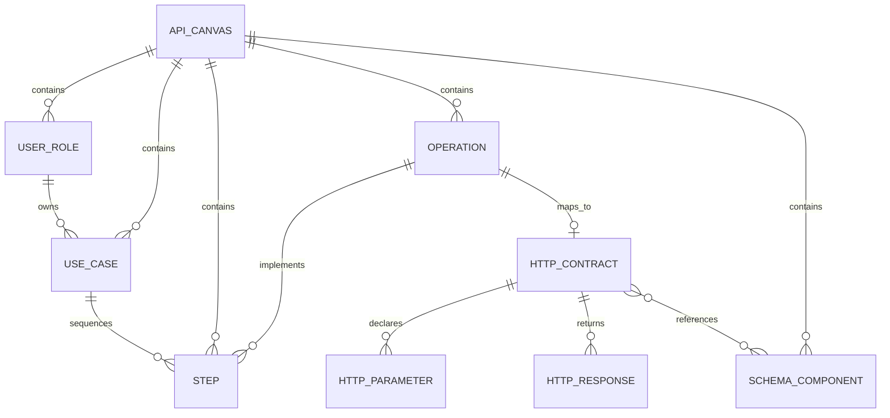

# Domain Model

The domain model represents an API design as business capabilities first and HTTP details second. This guide defines the aggregate, references, lifecycle rules, and validation behavior that code changes must preserve.

## Conceptual Model



`ApiCanvas` is the aggregate root. There are no references across canvases. Every role, use case, step, operation, and schema component needed by a canvas travels with that canvas during save, duplication, import, and export.

## Aggregate Root: `ApiCanvas`

| Field | Meaning | Important behavior |
| --- | --- | --- |
| `id` | Stable canvas identifier. New canvases use `crypto.randomUUID()`. | IndexedDB primary key and route parameter. Must be non-empty. |
| `name` | Human-facing API title. | Required; exported as `info.title`. |
| `description` | Optional overview. | Empty string is valid; exported as `info.description`. |
| `version` | API document version. | Required; defaults to `0.1.0`; exported as `info.version`. |
| `createdAt` | ISO timestamp from creation. | Preserved by normal mutations. |
| `updatedAt` | ISO timestamp of the latest domain mutation. | Replaced by every successful mutation; used for library sorting. |
| `roles` | Ordered user/actor definitions. | Referenced by use cases. |
| `useCases` | Ordered business outcomes. | Referenced by steps. |
| `steps` | Ordered capability narratives. | Join use cases to reusable operations. |
| `operations` | Reusable capabilities, optionally mapped to HTTP. | Referenced by steps; exported to OpenAPI when contracted. |
| `schemaComponents` | Reusable JSON Schemas. | Addressed by component name, not component ID. |
| `servers` | OpenAPI server URLs. | Omitted from OpenAPI when empty. |
| `tags` | Top-level OpenAPI tags. | Omitted from OpenAPI when empty. |

`createApiCanvas` trims name, description, and version. It creates empty collections and uses `0.1.0` when the supplied version is blank or absent. UI validation prevents creation with a blank title; domain validation remains the final invariant check.

## Capability Entities

### `UserRole`

A role identifies a person, system, or organizational actor using the API.

| Field | Rule |
| --- | --- |
| `id` | Non-empty and unique within `roles`. |
| `name` | Required. |
| `description` | Optional narrative. |
| `order` | Numeric display sequence among roles. |

The UI labels this concept **User** to keep the canvas approachable. The type uses `UserRole` to make its modeling purpose explicit.

### `UseCase`

A use case describes an outcome one role wants to achieve.

| Field | Rule |
| --- | --- |
| `id` | Non-empty and unique within `useCases`. |
| `roleId` | Must reference an existing role in the same canvas. |
| `title` | Required. |
| `description` | Optional narrative. |
| `order` | Numeric sequence within its role. |

`createUseCase` needs an existing role. If the requested role does not exist and no first role can be selected, it returns the original canvas unchanged. This prevents a convenience factory from manufacturing a dangling reference.

### `Step`

A step is one business-level action in a use case.

| Field | Rule |
| --- | --- |
| `id` | Non-empty and unique within `steps`. |
| `useCaseId` | Must reference an existing use case. |
| `operationId` | Must reference an existing reusable operation. |
| `title` | Required action label. |
| `input` | Optional description of what the action consumes. Empty means no documented input. |
| `success` | Required happy-path outcome narrative. |
| `failure` | Required failure outcome narrative. |
| `order` | Numeric sequence within its use case. |

`createStep` requires both parent references to exist and otherwise returns the original canvas unchanged. Selectors can still render an operation-less step defensively if old or hand-built data contains one, but validation reports that state as an error.

### `Operation`

An operation is a reusable capability that can implement steps in many use cases.

| Field | Rule |
| --- | --- |
| `id` | Non-empty and unique within `operations`. |
| `name` | Required. |
| `description` | Optional business description. |
| `httpContract` | Optional so capability discovery can precede transport design. |

An operation without a contract is valid work in progress and produces an informational issue rather than an error.

## HTTP Contract

`HttpContract` maps one operation to one OpenAPI operation.

| Field | Meaning and rule |
| --- | --- |
| `method` | One of `get`, `post`, `put`, `patch`, or `delete`. |
| `path` | Must start with `/`; template braces must be non-empty and non-nested. |
| `operationId` | Required and unique across contracted operations. |
| `summary` | Short OpenAPI summary. Empty is allowed while drafting. |
| `description` | Longer OpenAPI description. Empty is allowed. |
| `tags` | Operation-level OpenAPI tag names. |
| `parameters` | Path, query, header, or cookie parameters. |
| `requestBody` | Optional body with a media-type content map. |
| `responses` | At least one response is required. |

The method/path pair must be unique. Different methods may share a path and are merged under one OpenAPI Path Item.

### Default Contracts

`defaultContract(operationName)` creates:

- Method `GET`.
- A kebab-case path derived from the operation name.
- A camel-case `operationId` derived from the same name.
- One `200` response with description `Successful response`.
- Empty tags, parameters, response content, and contract description.

For example, `Search products` becomes `GET /search-products` with operation ID `searchProducts`. A name with no ASCII identifier characters falls back to `/resource` and `operation`.

The generated path is an editable starting point, not a claim that operation names are correct REST resources.

### Path Parameters

Every `{name}` in a path must have a matching parameter whose `in` is `path`, and that parameter must be required. Every declared path parameter must also appear in the template.

Parameter names are not restricted to JavaScript identifiers. A legal pair such as `{product-id}` and parameter name `product-id` is accepted.

### Parameters And Headers

`HttpParameter` is used for operation parameters and response headers.

- `id` provides stable UI identity.
- `name`, `in`, `description`, and `required` map directly to OpenAPI fields where applicable.
- `schemaRef` and `schema` are mutually exclusive schema sources.
- Path parameters created by `createParameter('path')` are required automatically.
- Other created parameters default to an inline string schema.

Response headers reuse the type even though OpenAPI Header Objects omit the `name` and `in` fields in their serialized value; the header name becomes the map key.

### Request Bodies And Responses

Content is a record from media type to `MediaTypePayload`. Keys must be token/token media types or wildcard ranges such as `*/*`; malformed keys such as `application/json/extra` are errors.

A response:

- Needs a non-empty description.
- Uses an explicit `100` through `599` code or `default`.
- Cannot duplicate a status within the same operation.
- May define headers and media-type payloads.

Validation warns when a contract has no `2xx` response or no `4xx`, `5xx`, or `default` response. These warnings describe design completeness and do not block export.

## JSON Schema

### `SchemaComponent`

| Field | Rule |
| --- | --- |
| `id` | Non-empty and unique within `schemaComponents`; used by UI mutations. |
| `name` | Unique component key matching `^[a-zA-Z0-9._-]+$`. |
| `schema` | Boolean or object JSON Schema node. |

Component references use names:

```text
#/components/schemas/Product
```

The component ID is deliberately separate from the OpenAPI name. Renaming a component can preserve UI identity while changing its exported key.

### Schema Sources

Parameters, response headers, request media types, and response media types can use either:

- `schemaRef`, which must resolve to a local component; or
- inline `schema`, which may be an object, `true`, or `false`.

Defining both is an error. The OpenAPI mapper uses an explicit reference-first branch defensively, but valid domain data never relies on precedence.

An empty string example is meaningful and is preserved. Boolean `false` schemas are meaningful and are preserved rather than treated as absent.

### Structured Editor Subset

The structured editor is available only for flat object schemas that can round-trip exactly:

- Root: `type`, `properties`, `required`.
- Property: `type`, optional `description`.

Any other keyword makes the schema JSON-only. This includes `title`, `format`, `enum`, nested object properties, array `items`, and extension keywords. Raw JSON mode preserves those values.

## Identity And Ordering

New entity IDs use `crypto.randomUUID()`. The seeded sample uses readable deterministic IDs for teaching and stable tests.

Order values are scoped:

- Role order is global within a canvas.
- Use-case order is interpreted within one role.
- Step order is interpreted within one use case.

Factories calculate `max(order) + 1` in the relevant scope. Validation does not require contiguous or unique order numbers. Modern JavaScript sorting is stable, so ties preserve collection order, but callers should assign intentional values when implementing reordering.

## Mutation Semantics

Every successful mutation returns a new canvas and refreshes `updatedAt`. Invalid merge or parent-dependent create requests return the exact original object so UI history does not record a false change.

### Creation And Update

| Mutation | Behavior |
| --- | --- |
| `createRole` | Appends `Role N` at the next role order. |
| `createUseCase` | Appends `Use case N` under an existing role; no-op without one. |
| `createOperation` | Appends `Operation N` without an HTTP contract. |
| `createStep` | Appends `Step N` under valid use-case and operation parents; narratives start empty. |
| `createSchemaComponent` | Appends `SchemaN` as an empty object schema. |
| `update*` | Replaces matching records immutably. Patch types require complete editable fields for that entity. |
| `setOperationContract` | Attaches, replaces, or removes one operation's contract. |

Update functions assume the caller supplies a valid target ID and references. They still produce a touched canvas if the ID does not match; use validation at boundaries and avoid speculative updates.

### Cascade Deletion

| Deleted entity | Automatic consequence |
| --- | --- |
| Role | Delete its use cases and every step under those use cases. |
| Use case | Delete its steps. |
| Operation | Delete every step that references it. |
| Step | No dependent records. |
| Schema component | No automatic reference rewrite or deletion. |

The schema editor disables direct deletion while top-level contract fields reference a component. The domain mutation itself remains simple, and validation catches unresolved references if a caller deletes anyway. `$ref` values nested inside arbitrary inline JSON Schema are not rewritten by schema deletion.

### Merge

`mergeRole(source, target)` moves source use cases to the target role, removes the source role, and preserves all steps.

`mergeOperation(source, target)` moves source step references to the target operation and removes the source operation. The target operation and its HTTP contract are preserved; a source contract is discarded. The UI confirms this consequence before applying the mutation.

Self-merges and merges involving a missing source or target return the original canvas.

### Schema Rename

`updateSchemaComponent` detects a name change and rewrites exact top-level schema refs in:

- Operation parameters.
- Request body media payloads.
- Response headers.
- Response media payloads.

It does not rewrite `$ref` strings nested inside arbitrary inline schemas or other schema component bodies. Those structures are intentionally treated as user-authored JSON.

### Canvas Duplication

`duplicateApiCanvas` creates an independent canvas:

- New canvas, role, use-case, operation, step, and schema component IDs.
- Rewritten internal `roleId`, `useCaseId`, and `operationId` references.
- New parameter and response-header IDs inside contracts.
- Contract `operationId` values suffixed with `Copy`.
- Name suffixed with the text `copy`, preceded by a space.
- New creation and update timestamps.

Schema component names and their `$ref` paths remain unchanged because the duplicate is a separate aggregate.

## Selectors

`getCanvasRows` joins each step to its use case, role, and optional operation. Rows sort by role order, then use-case order, then step order. A step with a missing use-case or role is omitted because it cannot be placed in a capability lane. A missing operation is preserved as `undefined` so incomplete data remains visible.

`getOperationRows` starts from canvas rows, then groups by operation collection order. Within an operation it sorts by role, use case, and step. Missing operations sort after known operations.

`summarizeApi` returns counts for library and workspace badges; it does not perform validation.

## Validation Catalog

### Errors

- Empty API ID, title, or version.
- Blank or duplicate IDs in any top-level entity collection.
- Blank role name, use-case title, step title, or operation name.
- Unknown role referenced by a use case.
- Unknown use case or operation referenced by a step.
- Missing step success or failure narrative.
- Invalid, blank, or duplicate schema component name.
- Empty or duplicate HTTP `operationId`.
- Duplicate method/path pair.
- Path not beginning with `/`.
- Empty, unmatched, or nested path-template braces.
- Missing, optional, or unused path parameter declarations.
- Contract without a response.
- Response without a description.
- Invalid or duplicate response status.
- Invalid media type key.
- Simultaneous inline schema and component reference.
- Dedicated schema reference that does not resolve to a local component.

### Warnings

- Contract has no success response.
- Contract has no failure/default response.
- Schema component is not referenced by a contract field or inline contract schema.

### Information

- Operation has no HTTP contract yet.

Issue IDs are deterministic combinations of severity, path, and message. The UI uses them as React keys and displays their machine-oriented path to help locate the source.

## Intentional Optional Fields

The following empty values are valid and should not be "fixed" without a product decision:

- API, role, use-case, operation, contract, parameter, request-body, and schema property descriptions.
- Step input.
- Contract summary and tags.
- Parameter and payload schemas where OpenAPI permits an empty Media Type Object during drafting.
- Request body content may be empty in the TypeScript model, though the UI creates an `application/json` entry by default.

Required narratives are deliberately limited to identity, step outcomes, response descriptions, and OpenAPI metadata.
